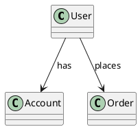

# Classes and Relationships Comparator

A comprehensive tool for comparing manually created class diagrams with LLM-generated class diagrams from user stories.

## Features

### Core Comparison
- **Multi-format Support**: JSON, CSV, Excel (XLSX), and PlantUML
- **Class Comparison**: Compare classes between manual and LLM-generated diagrams
- **Relationship Comparison**: Compare relationships (associations, inheritance, etc.)
- **Detailed Metrics**: Precision, Recall, and F1 Score for each story and overall

### Visualization & Reporting
- **Interactive UML Diagrams**: Generate color-coded class diagrams with vis.js
- **PDF Reports**: Comprehensive comparison reports with metrics and tables
- **PlantUML Export**: Export diagrams to PlantUML format
- **Comparison Timeline**: Track metrics over time
- **Heatmap Visualization**: View similarity patterns across user stories

### Advanced AI Integration
- **Semantic Similarity Matching**: Uses Levenshtein, Jaccard, and Cosine similarity
- **Auto-Suggestion Engine**: Suggests potential matches for unmatched items
- **Confidence Scores**: Calculates confidence for each match
- **LLM Provider Support**: Ready for OpenAI, Anthropic Claude, Google Gemini integration

### Data Management
- **Database Persistence**: H2 (development) and PostgreSQL (production) support
- **Comparison History**: Store and retrieve historical comparisons
- **Baseline Comparison**: Set baselines and track improvements
- **API Key Management**: Secure storage with BCrypt encryption

### Quality Metrics Dashboard
- **Trend Analysis**: View metric trends over time (daily/weekly/monthly)
- **Per-Story Metrics**: Detailed metrics for each user story
- **Anomaly Detection**: Flag unusual comparison results
- **Baseline Comparison**: Compare current results against baseline

## Technology Stack

### Backend
- Java 21
- Spring Boot 3.5.0
- Spring Data JPA
- H2 Database (development)
- PostgreSQL (production)
- Apache POI (Excel)
- Apache Commons CSV
- iText7 (PDF generation)
- PlantUML
- Apache OpenNLP (NLP operations)
- BCrypt (encryption)

### Frontend
- HTML5, CSS3, JavaScript
- Chart.js (metrics visualization)
- vis.js (network diagrams)

## Getting Started

### Prerequisites
- Java 21 or higher
- Maven 3.9+
- Node.js (for frontend development)

### Installation

1. Clone the repository:
```bash
git clone https://github.com/ThakurVipulUP72/classes-and-relationships-comparator.git
cd classes-and-relationships-comparator
```

2. Build the backend:
```bash
cd class-comparer/backend
mvn clean install
```

3. Run the backend:
```bash
mvn spring-boot:run
```

4. Open the frontend:
```bash
cd ../frontend
# Open index.html in a browser or use a local server
python -m http.server 3000  # Or use any other method
```

### Configuration

Edit `class-comparer/backend/src/main/resources/application.properties`:

```properties
# Server Configuration
server.port=8080

# Database (H2 for development)
spring.datasource.url=jdbc:h2:mem:classcomparer
spring.jpa.hibernate.ddl-auto=update

# File Upload
spring.servlet.multipart.max-file-size=50MB
spring.servlet.multipart.max-request-size=50MB

# LLM Configuration (optional)
llm.enabled=true
llm.provider=openai
llm.api.key=${LLM_API_KEY}
llm.model=gpt-4
```

## API Endpoints

### File Upload & Comparison
- `POST /api/upload` - Upload JSON files for comparison
- `POST /api/import/csv` - Import CSV files
- `POST /api/import/plantuml` - Import PlantUML files

### Export & Visualization
- `GET /api/export/excel` - Export results to Excel
- `POST /api/export/modified` - Export modified results
- `POST /api/visualize/pdf` - Generate PDF report
- `POST /api/visualize/plantuml` - Export to PlantUML
- `POST /api/visualize/diagram` - Get diagram data for vis.js

### Metrics & History
- `GET /api/metrics/history` - Get comparison history
- `GET /api/metrics/trend` - Get metric trends
- `GET /api/metrics/heatmap` - Get heatmap data

### Suggestions & AI
- `POST /api/suggestions` - Get match suggestions
- `POST /api/suggestions/story/{index}` - Get story-specific suggestions

### Baseline Management
- `POST /api/baseline` - Set comparison as baseline
- `GET /api/baseline` - Get current baseline
- `GET /api/baseline/compare/{id}` - Compare against baseline
- `DELETE /api/baseline` - Delete baseline

### API Key Management
- `POST /api/keys` - Add API key
- `GET /api/keys` - List API keys (masked)
- `DELETE /api/keys/{id}` - Delete API key

## Usage Examples

### JSON Format
```json
{
  "Dataset_Name": {
    "stories": [
      {
        "story_id": "1",
        "classes": ["User", "Account", "Order"],
        "relationships": [
          {"source": "User", "relation": "has", "target": "Account"},
          {"source": "User", "relation": "places", "target": "Order"}
        ]
      }
    ]
  }
}
```

### CSV Format (Classes)
```csv
Story,Class
Story_1,User
Story_1,Account
Story_1,Order
```

### CSV Format (Relationships)
```csv
Story,Source,Relation,Target
Story_1,User,has,Account
Story_1,User,places,Order
```

### PlantUML Format


## Development

### Project Structure
```
class-comparer/
├── backend/
│   ├── src/main/java/com/example/classcompare/
│   │   ├── controller/      # REST controllers
│   │   ├── service/         # Business logic
│   │   ├── entity/          # JPA entities
│   │   ├── repository/      # Data repositories
│   │   ├── model/           # DTOs and models
│   │   └── util/            # Utilities
│   └── pom.xml
└── frontend/
    └── index.html
```

### Building for Production

1. Update `application.properties` for PostgreSQL:
```properties
spring.datasource.url=jdbc:postgresql://localhost:5432/classcomparer
spring.datasource.username=your_username
spring.datasource.password=your_password
```

2. Build JAR:
```bash
mvn clean package
java -jar target/classcompare-1.0.0.jar
```

## Contributing

Contributions are welcome! Please follow these steps:

1. Fork the repository
2. Create a feature branch
3. Make your changes
4. Add tests
5. Submit a pull request

## License

This project is open source. See LICENSE for details.

## Acknowledgments

- Spring Boot team for the excellent framework
- Apache POI for Excel support
- iText for PDF generation
- PlantUML for diagram support